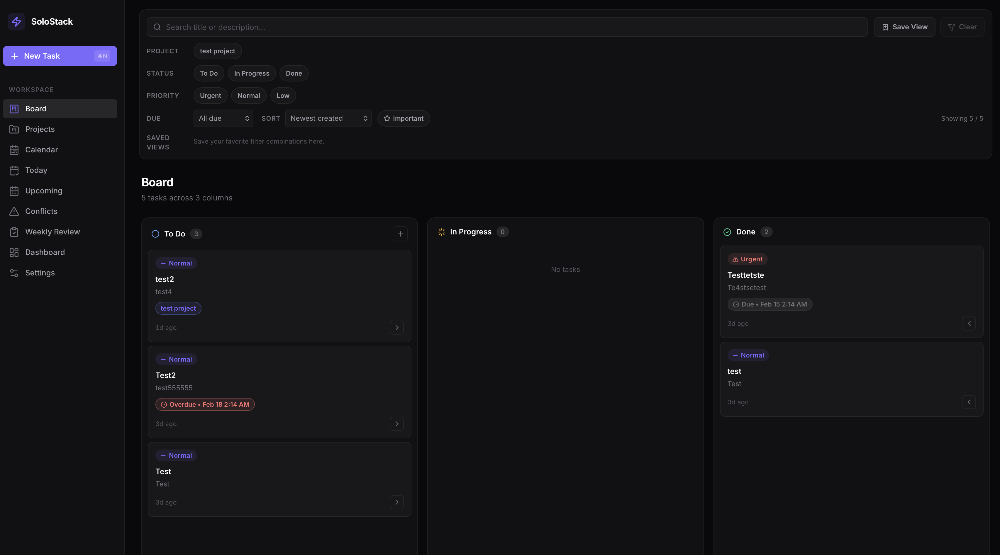

# ⚡ SoloStack



A minimal, beautiful solo task management app built with **Tauri + React + TypeScript**.

Designed for individual developers who want a distraction-free, lightning-fast kanban board running natively on their desktop.

## ✨ Features

- 📋 **Kanban Board** — Drag-and-drop tasks across To Do, In Progress, and Done columns
- 🔎 **Search + Filters + Sort** — Quickly narrow tasks by text, status, priority, importance, due window, and per-view ordering
- 💾 **Saved Views** — Save and reapply custom filter combinations
- 🧩 **Task Templates** — Save reusable presets for recurring task patterns
- ✅ **Subtasks / Checklist** — Break tasks into actionable checklist items with progress tracking
- 🗓️ **Today & Upcoming Views** — Focus on overdue/today tasks and the next 7 days at a glance
- ⏰ **Due Dates & Reminders** — Add schedule metadata directly in task form
- 🧠 **Natural Language Due Date** — Parse phrases like `tomorrow 9am`, `next monday`, and `in 3 days`
- 🔁 **Recurring Tasks** — Repeat tasks daily, weekly, or monthly
- 🔔 **Desktop Notifications** — Native reminder notifications via Tauri plugin (click to open task)
- ⌨️ **Command Palette** — `⌘/Ctrl + K` to jump views, create, quick capture, and update task status fast
- 🗂️ **Weekly Review** — Auto-summarize completed, pending, and overdue workload for the current week
- 🧰 **MVP CLI** — Manage projects/tasks from terminal (`list/create/update/done/quick-capture`)
- 📊 **Dashboard** — Visualize your productivity at a glance
- 📈 **Momentum Metrics** — Track due today, overdue, and completed-this-week trends
- ⚙️ **Reminder Settings** — Toggle reminders and reset permission/history from Settings
- 💾 **Local-first** — All data stored locally via SQLite, no account needed
- ⚡ **Blazing fast** — Powered by Tauri for near-native performance
- 🎨 **Beautiful UI** — Dark-themed, modern design with smooth animations
- ⌨️ **Keyboard shortcuts** — `⌘/Ctrl + N` for full form and `⌘/Ctrl + Shift + N` for Quick Capture

## 🛠️ Tech Stack

| Layer      | Technology                |
|------------|---------------------------|
| Framework  | Tauri 2                   |
| Frontend   | React 19 + TypeScript     |
| Styling    | CSS Variables + Lucide Icons |
| State      | Zustand + React Query     |
| Database   | SQLite (via tauri-plugin-sql) |
| Build      | Vite 7                    |

## 🚀 Getting Started

### Prerequisites

- [Node.js](https://nodejs.org/) (v18+)
- [Rust](https://rustup.rs/) (latest stable)
- [Tauri prerequisites](https://v2.tauri.app/start/prerequisites/)

### Development

```bash
# Install dependencies
npm install

# Run in development mode
npm run tauri dev
```

### MVP CLI

```bash
# Show help
npm run mvp-cli -- help

# Create a project
npm run mvp-cli -- project create --name "Client A" --color "#3B82F6"

# Quick capture a task
npm run mvp-cli -- quick-capture "Fix login race condition"

# Create a task in a project
npm run mvp-cli -- task create --title "Draft release note" --project "Client A" --priority NORMAL --due 2026-02-20

# Mark a task done
npm run mvp-cli -- task done --id <task-id>
```

CLI options:
- Use `--json` for machine-readable output.
- Use `--db <path>` to target a specific SQLite file.
- `mvp-cli` requires Node.js 22+ (uses built-in `node:sqlite`).

### MCP Server Skeleton

```bash
# Run local MCP server
npm run mcp:dev
```

Default health endpoints:
- `GET http://127.0.0.1:8799/`
- `GET http://127.0.0.1:8799/health`
- `GET http://127.0.0.1:8799/healthz`

Read tool endpoints:
- `POST http://127.0.0.1:8799/tools/get_tasks`
- `POST http://127.0.0.1:8799/tools/get_projects`
- `POST http://127.0.0.1:8799/tools/get_weekly_review`
- `POST http://127.0.0.1:8799/tools/search_tasks`
- `POST http://127.0.0.1:8799/tools/get_task_changelogs`
- `POST http://127.0.0.1:8799/tools` (generic route)

See `mcp-solostack/README.md` for env configuration.

### Build for Production

```bash
npm run tauri build
```

The built application will be available in `src-tauri/target/release/bundle/`.

## 📂 Project Structure

```
MVP/
├── src/                    # React frontend
│   ├── components/         # UI components (AppShell, TaskBoard, Dashboard, etc.)
│   ├── hooks/              # Custom React hooks
│   ├── lib/                # Types and utilities
│   └── store/              # Zustand state management
├── src-tauri/              # Tauri backend (Rust)
│   ├── src/                # Rust source (lib.rs, db.rs)
│   ├── icons/              # App icons
│   └── tauri.conf.json     # Tauri configuration
├── mcp-solostack/          # MCP server skeleton (Node.js)
└── package.json
```

## ☕ Support

If you find SoloStack useful and want to support its development, consider buying me a coffee!

[](https://ko-fi.com/Y8Y71U8RJO)

Your support helps keep this project alive and motivates future improvements. Every coffee counts! ❤️

## 📄 License

MIT

---

<p align="center">
  Built with ❤️ by a solo developer, for solo developers.
</p>
